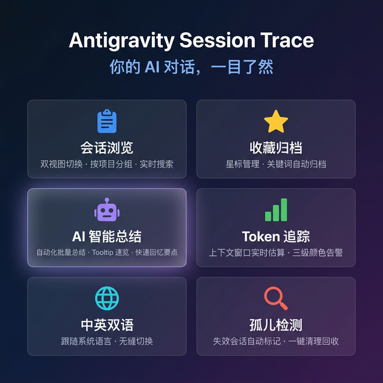

# Antigravity Session Trace

> 追踪、浏览、总结你的 Antigravity 对话历史。

<p align="center">
  
</p>

## ✨ 功能速览

### 🗂 会话浏览

- **Activity Bar 原生侧栏** — 按 workspace 自动分组，当前项目置顶展开
- **多维度排序** — 最近修改 / 创建时间 / 名称
- **快速筛选** — 全部 / 按 workspace / 仅收藏 / 仅活跃（隐藏归档）
- **实时搜索** — 按标题和 workspace 即时匹配

### ⭐ 收藏与归档

- **星标收藏** — 重要会话一键收藏，筛选时单独查看
- **关键词归档** — 配置关键词（如 `@[/close]`），自动标记已结束的会话
- **手动归档** — 右键菜单一键切换归档状态

### 🤖 AI 总结

- **手动总结** — 右键会话，一键调用 AI 生成结构化摘要
- **自动队列** — 启动时检测可总结的会话，批量处理
- **双格式支持** — 兼容 OpenAI 和 Gemini API
- **安全存储** — API Key 通过系统级 SecretStorage 保存，不写入配置文件

### 📊 数据面板

- **Token 用量 Dashboard** — 纯 SVG 柱状图 + 环形图，零外部依赖
- **状态栏 Token Tracker** — 实时显示当前会话上下文窗口估算
  - 🟢 正常 → 🔥 偏高（>200k）→ ⚠️ 警告（>500k）
- **统计面板** — 会话总数、消息量、失效会话诊断 + 一键清理

### 🌐 双语支持

- 中英文自适应，跟随 VS Code 界面语言
- 命令面板、侧栏、提示消息、设置描述全覆盖

## 📦 安装

### 方式一：本地开发安装

```bash
git clone https://github.com/Dongmayyys/antigravity-session-trace.git
cd antigravity-session-trace
npm install
npm run compile
```

然后在 VS Code / Antigravity 中：

1. `Ctrl+Shift+P` → `Developer: Install Extension from Location...`
2. 选择项目根目录

### 方式二：VSIX 安装

```bash
npm run package   # 生成 .vsix 文件
```

然后 `Ctrl+Shift+P` → `Extensions: Install from VSIX...`

## ⚙️ 配置

在 Settings 中搜索 `Conversation Manager`：

| 设置项                            | 说明                               | 默认值            |
| --------------------------------- | ---------------------------------- | ----------------- |
| `convManager.ai.endpoint`       | AI API 地址                        | —                |
| `convManager.ai.format`         | API 格式（openai / gemini）        | `openai`        |
| `convManager.ai.model`          | 模型名称                           | —                |
| `convManager.ai.prompt`         | 自定义总结提示词（留空用内置默认） | —                |
| `convManager.ai.autoSummarize`  | 自动总结模式（ask / on / off）     | `ask`           |
| `convManager.ai.minMessages`    | 自动总结最少消息数                 | `5`             |
| `convManager.ai.cooldownHours`  | 跳过近期活跃会话的小时数           | `2`             |
| `convManager.ai.staleThreshold` | 总结过期的新增消息阈值             | `10`            |
| `convManager.archiveKeywords`   | 自动归档关键词列表                 | `["@[/close]"]` |

**API Key 设置**：`Ctrl+Shift+P` → `Conversations: Set AI API Key`

> API Key 通过系统安全存储保存，不会出现在 settings.json 中。

## 🏗 技术架构

```
Activity Bar (Tree View)              Editor Area (Webview)
┌──────────────────┐                 ┌─────────────────────┐
│ 📁 my-project    │                 │ 💬 对话内容面板      │
│   💬 会话 A      │  ──点击打开──▶  │  Markdown 渲染       │
│   ⭐ 会话 B      │                 │  代码一键复制        │
│   ✨ 会话 C      │                 │  AI 总结卡片         │
│ 📁 other-proj    │                 └─────────────────────┘
│   💬 会话 D      │                 ┌─────────────────────┐
│ 🌐 (无 workspace)│                 │ 📊 统计 / Dashboard  │
│   ⚪ 会话 E      │                 │  Token 柱状图        │
└──────────────────┘                 │  模型分布环形图      │
                                     └─────────────────────┘
状态栏: $(pulse) 128k tokens · 会话标题
```

### 数据来源

| 层级     | 来源                             | 说明                       |
| -------- | -------------------------------- | -------------------------- |
| 会话发现 | `~/.gemini/antigravity/brain/` | 文件系统扫描，离线可用     |
| 会话内容 | Antigravity 本地 RPC API         | 需要 Antigravity 运行中    |
| AI 总结  | OpenAI / Gemini API              | 用户自行配置               |
| 持久化   | VS Code `globalState`          | 标题、排序、收藏、总结缓存 |

### 技术栈

- **运行时**: VS Code Extension Host (Node.js)
- **框架**: VS Code Extension API (^1.96.0)
- **语言**: TypeScript 5.x (strict mode)
- **打包**: esbuild (单文件输出)
- **国际化**: VS Code l10n API (中英双语)

## 🔧 开发

```bash
# 安装依赖
npm install

# 开发模式（推荐，保存即编译）
npm run watch

# 调试
# F5 启动 Extension Development Host

# 一次性编译
npm run compile

# 生产构建
npm run compile:production
```

## 📄 许可证

MIT

## 🙏 致谢

- [vscode-session-trace](https://github.com/digitarald/vscode-session-trace) — 架构参考
- [antigravity-storage-manager](https://github.com/unchase/antigravity-storage-manager) — API 逆向参考
